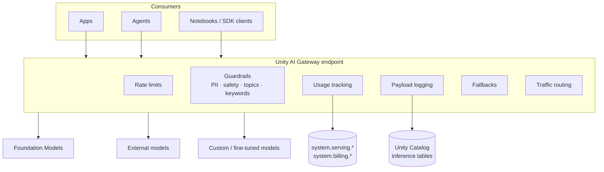

# Architecture

The Unity AI Gateway is a governed control plane that sits between every AI consumer
(apps, agents, notebooks) and the models, tools, and agents they call. Controls are
configured **once on the endpoint** and apply uniformly to all callers.

## Control plane vs. data plane

- **Configuration (control plane):** rate limits, guardrails, usage tracking, payload
  logging, fallbacks, and traffic config are set via the AI Gateway API
  (`PUT /api/2.0/serving-endpoints/{name}/ai-gateway`) and the endpoint config API. The
  labs drive these through `shared/setup.py` and the Databricks SDK.
- **Inference (data plane):** clients call `POST /serving-endpoints/{name}/invocations`
  with an OpenAI-compatible chat payload. The Gateway enforces controls inline, then
  routes to the selected served entity.

## Where governance data lands

| Signal | Location | Used by |
|--------|----------|---------|
| Per-request token usage + identity | `system.serving.endpoint_usage` | Lab 03 (FinOps) |
| DBU cost + pricing | `system.billing.usage`, `system.billing.list_prices` | Lab 03 (FinOps) |
| Full request/response payloads | Unity Catalog inference table (`<catalog>.<schema>.gateway_*`) | Audit, eval, guardrail review |
| Access control | Unity Catalog permissions | Tools / Agents labs |

## How the labs compose

Models labs are independent controls on one endpoint; later categories build on them:

- **Tools** labs govern MCP servers and Unity Catalog functions that agents call.
- **Agents** labs assemble agents whose every model/tool call flows through governed
  endpoints, inheriting all the Models-layer controls.
- The **zero-to-production** capstone composes these into one production-ready endpoint.
